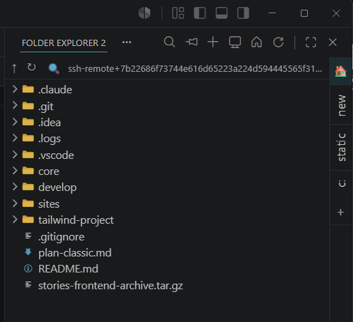
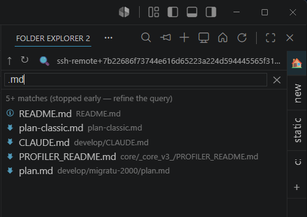

<p align="center">
  
</p>

<h1 align="center">VS Folder Explorer</h1>

<p align="center">A second, independent file explorer for VS Code: a panel with a right-side bookmark strip that can point at any folder — above the workspace, on another disk, on the SSH host, or on your local machine while you are connected to Remote-SSH.</p>

---

> ### Tired of typing prompts manually? 🎤
> Try **[Murmur](https://murmurvt.com/)** — offline voice-to-text for Windows. Fast, private, no cloud. 👉 https://murmurvt.com/

---

## Why

The built-in Explorer is locked to the workspace root and there is only one of it.
This adds a **second, independent explorer** you can dock next to it (e.g. in the
Secondary Side Bar) and point at *any* folder — above the project, on another
disk, on the SSH host, or on your local machine while you are connected to SSH.

## Screenshots

| Browsing a Remote-SSH folder | Live search |
| :---: | :---: |
|  |  |

## Features

- **Bookmark strip** — a vertical strip of one-click directory bookmarks down the
  right edge. The active project is a permanent entry; your own bookmarks live
  below it. Bookmarks are scoped per project, so they never bleed between
  workspaces or SSH hosts.
- **Browse anywhere** — walk above the workspace root, jump to any absolute path,
  or return to the project. Not limited to a single root like the built-in
  Explorer.
- **Local folders inside a Remote-SSH window** — a custom `vsfe-local:`
  file-system provider reads the local machine directly, so you can browse and
  open files from *your computer* even while connected to an SSH host.
- **Cross-environment copy & paste** — Copy in one bookmark, Paste in another,
  across any combination of local, `vsfe-local:`, and SSH locations. Transfers
  run through `workspace.fs`, so local ↔ SSH and SSH ↔ SSH all work.
- **Windows clipboard bridge** — Ctrl+C in the panel makes the file pastable in
  Windows Explorer, and a file copied in Windows Explorer can be pasted into the
  panel — including onto an SSH target. Remote files are materialized to a local
  temp file first so the OS clipboard can carry them.
- **Live search** — a filter box recursively narrows the tree as you type, with a
  spinner while it runs. A new keystroke cancels the search in flight, and Enter
  re-runs it against the current bookmark. Clearing it restores the tree.
- **Hover info** — hover a file to see its size, or a folder to see its item count,
  total size, and recursive file/folder counts. Image files show a thumbnail
  preview instead. Folder sizes over SSH are computed on a time budget, so a huge
  tree returns a partial answer rather than hanging.

> **Note:** when you Copy a large folder from an SSH host, it is first buffered to
> the local machine. Wait for the **Buffering…** progress in the bottom-right of
> VS Code to finish (the status bar shows *“N item(s) ready to paste”*) before you
> paste.

## Install

Download the latest `.vsix` from the [Releases](../../releases) page, then:

```bash
code --install-extension vs-folder-explorer-<version>.vsix
```

The extension declares `extensionKind: ["ui", "workspace"]`, so over Remote-SSH it
runs locally and you do **not** need to install it on the SSH host.

## Usage

1. Open **Folder Explorer 2** from the Activity Bar.
2. Drag the **Folder Explorer** view to the right edge (Secondary Side Bar) if you
   want it there — VS Code remembers the position.
3. Add directories with **Add Bookmark…** / **Add Local Folder…**, then click the
   strip to switch between them.
4. Right-click items for Copy / Paste / New Folder / Rename / Delete / Reveal, or
   use Ctrl+C / Ctrl+V — copy and paste works across bookmarks and to and from
   Windows Explorer.

## Build from source

```bash
npm install
npm run compile      # or press F5 to launch an Extension Development Host
npx @vscode/vsce package
```

## Settings

- `vsfe.search.exclude` — folder names skipped while searching (default: `.git`,
  `node_modules`, `bin`, `obj`, …).
- `vsfe.search.maxResults` — file collection limit for search.

## Credits

File icons use the **Seti UI** icon set — the default file icon theme shipped with
VS Code (`theme-seti`), MIT-licensed. `media/seti.woff` and its mapping are bundled
from that theme.

## License

[MIT](LICENSE) © Yaroslav Gorohov
